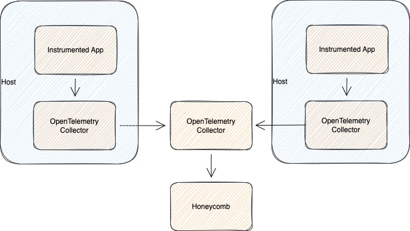

# Sample Opentelemetry Collector Configuration

This directory contains several sample collector configuration files you can adapt to your use case.

## Table of contents
1. [What is the Opentelemetry Collector](#what-is-the-opentelemetry-collector)
2. [Agent, Gateway, or Both?](#agent-gateway-or-both)

### What is the Opentelemetry Collector?
The [OpenTelemetry Collector](https://opentelemetry.io/docs/collector/) offers a vendor-agnostic way to gather observability data from a variety of instrumentation solutions and send that data to Honeycomb. 

You deploy the collector as a service. 

### Agent, Gateway, or Both?

You can choose to deploy the collector in agent mode, in gateway mode, or both. 

_Agent_: A Collector instance running with the application or on the same host as the application (e.g. binary, sidecar, or daemonset).

_Gateway_: One or more Collector instances running as a standalone service (e.g. container or deployment) typically per cluster, data center or region.

**When should I deploy the collector in agent mode?**

- You need to run the collector close to the application. When sending data to Honeycomb, this offloads the work of batching, retrying, and queuing from your application.
- You need to reduce inter-node traffic within your cluster.
- Different applications need different collector configurations (e.g. processor configs, sampling configs, etc.)
- You want to use the `hostmetrics` scraper to collect host and application metrics

**When should I deploy the collector in gateway mode?**

- You want to run a standalone collector with configuration enforced by a central team (sampling decisions, attribute redaction, etc.)
- You need to provide an API key or authentication for your exporters 

You can scale the collector in gateway mode horizontally or vertically by running several instances of the collector behind a load balancer.

