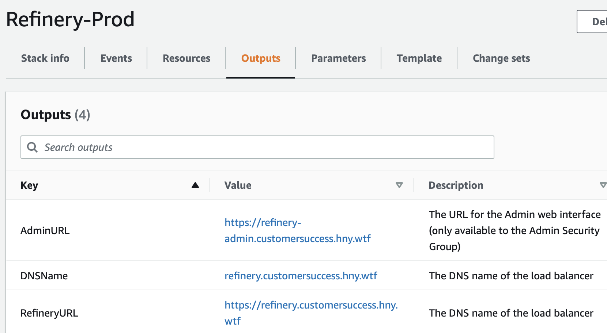

# Refinery AWS Cloudformation Deployment

This project aims to build a click-to-run deployment solution for Refinery that:
* Matches the patterns and best practices for high-performance cloud-native Refinery clusters
* Aims to be as easy to deploy as humanly possible for AWS users
* Aims to be relatively easy to run: update-able, self-healing, auto-scaling

Features:
* Uses AWS Graviton (ARM), Amazon Linux 2022 and Spot instance pricing for maximum performance and cost effectiveness
* Uses Autoscaling group to dynamically scale the cluster size up and down based on CPU usage
* Everything is provisioned for High Availability by default
* All Refinery Metrics and Logs, as well as host metrics are sent to Honeycomb for easy analysis


## Deployment

You can launch this stack with the push of a button:
<p><a href="https://console.aws.amazon.com/cloudformation/home#/stacks/new?templateURL=https:%2F%2Fs3.amazonaws.com%2Frefinery-marketplace-test%2Frefinery.yaml&amp;stackName=Refinery-Prod" target="_blank"></a></p>

Before you fire it up, there are a few things you should make sure you have prepped and ready.
* Please review the [Prerequisites](#prequisites)


Launching via the aws CLI:
```bash
# clone and edit the stack parameters
cp stack_parameters.json.example stack_parameters.json
code stack_parameters.json

aws cloudformation create-stack \
  --template-url https://s3.amazonaws.com/refinery-marketplace-test/refinery.yaml \
  --stack-name Refinery-Prod \
  --capabilities CAPABILITY_IAM \
  --on-failure DO_NOTHING \
  --parameters file://stack_parameters.json

# To update a parameter or pick up a new stack version
aws cloudformation update-stack \
  --template-url https://s3.amazonaws.com/refinery-marketplace-test/refinery.yaml \
  --stack-name refinery-test \
  --capabilities CAPABILITY_IAM \
  --parameters file://stack_parameters.json
```

## Architecture Diagram


## Deploying / Updating Sampling Rules

Use the Refinery Admin interface to deploy Refinery's Sampling rules:


Available at the `AdminURL` output of the Stack

## Operating the cluster

Watch the Cloudformation interface to see that the deployment is complete.  Once it is, head to the Outputs section to see the URLs of Refinery and the Admin interface:


Deploy the [Refinery Starter Pack]() Terraform module to get instant Honeycomb boards and stats for Refinery


## Prequisites

The following preparation steps are required, unless otherwise noted:
1. Identify the VPC ID and Subnet IDs where the cluster will be deployed.
2. Create or select the [AWS EC2 Keypair](https://docs.aws.amazon.com/AWSEC2/latest/UserGuide/ec2-key-pairs.html) you'll be using for SSH access, in the desired AWS region
3. Create or Upload the [AWS Certificate Manager Certificate](https://docs.aws.amazon.com/acm/latest/userguide/gs.html) for Refinery in the desired region.
  * A Wildcard SSL certificate is recommended (`*.mydomain.com`), and ACM can generate and manage these for you for free
4. *Optional but Recommended:* Have an [AWS Route53 Hosted Zone ready to use](https://docs.aws.amazon.com/Route53/latest/DeveloperGuide/CreatingHostedZone.html).
5. Create or select an [AWS VPC Security Group for administrative access](https://docs.aws.amazon.com/vpc/latest/userguide/VPC_SecurityGroups.html) (SSH and Admin Web Interface)


## LocalDev workflow

```bash
# Validate the template
aws cloudformation validate-template --template-body file://refinery.yaml

# Create a stack
aws cloudformation create-stack --template-body file://refinery.yaml \
  --stack-name refinery-test \
  --capabilities CAPABILITY_IAM \
  --on-failure DO_NOTHING \
  --parameters file://stack_parameters.json

# Update the stack
aws cloudformation update-stack --template-body file://refinery.yaml \
  --stack-name refinery-test \
  --capabilities CAPABILITY_IAM \
  --parameters file://stack_parameters.json

# Publish
aws s3 cp refinery.yaml s3://refinery-marketplace-test/refinery.yaml --acl public-read
```
